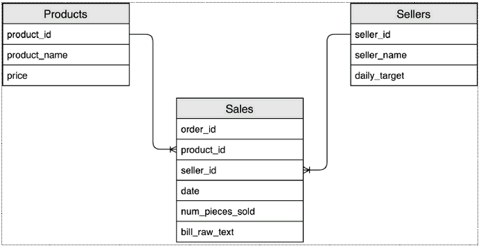

Using your preferred IDE setup a project to handle this exercises:

Unzip data from **exercise_data.zip ** into a local folder and use it as input source  
Requirements:
# Pyspark
pip install pyspark
# Pyspark stubs
pip install pyspark-stubs

The following diagram shows how the tables can be connected

**Sales Table**
Each row in this table is an order and every order can contain only one product. Each row stores the following fields:

    order_id: The order ID
    product_id: The single product sold in the order. All orders have exactly one product)
    seller_id: The selling employee ID that sold the product
    num_pieces_sold: The number of units sold for the specific product in the order
    bill_raw_text: A string that represents the raw text of the bill associated with the order
    date: The date of the order.

**Products Table**
Each row represents a distinct product. The fields are:

    product_id: The product ID
    product_name: The product name
    price: The product price

**Sellers Table**
This table contains the list of all the sellers:

    seller_id: The seller ID
    seller_name: The seller name
    daily_target: The number of items (regardless of the product type) that the seller needs to hit his/her quota. For example, if the daily target is 100,000, the employee needs to sell 100,000 products he can hit the quota by selling 100,000 units of product_0, but also selling 30,000 units of product_1 and 70,000 units of product_2

**# Exercises:**  
1.Find out how many orders, how many products and how many sellers are in the data.  
2.How many products have been sold at least once? Which is the product contained in more orders?  
3.How many distinct products have been sold in each day?  
4.What is the average revenue of the orders?  
5.For each seller, what is the average % contribution of an order to the seller's daily quota?
# Example
If Seller_0 with `quota=250` has 3 orders:  
Order 1: 10 products sold  
Order 2: 8 products sold  
Order 3: 7 products sold  
The average % contribution of orders to the seller's quota would be:  
Order 1: 10/105 = 0.04  
Order 2: 8/105 = 0.032  
Order 3: 7/105 = 0.028  
Average % Contribution = (0.04+0.032+0.028)/3 = 0.03333  
6.Who are the second most selling and the least selling persons (sellers) for each product? Who are those for product with `product_id = 0`  
7.Create a new column called "hashed_bill" defined as follows:
- if the order_id is even: apply MD5 hashing iteratively to the bill_raw_text field, once for each 'A' (capital 'A') present in the text. E.g. if the bill text is 'nbAAnllA', you would apply hashing three times iteratively (only if the order number is even)
- if the order_id is odd: apply SHA256 hashing to the bill text
- check if there are any duplicate on the new column
- Hint : use UDF to generate the column
